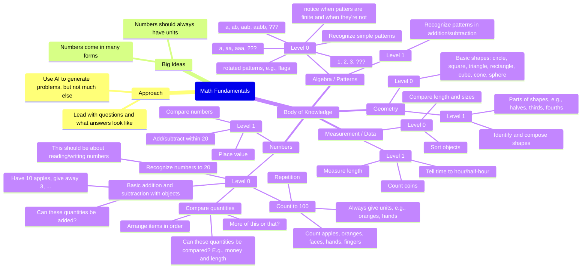

```mermaid
%%{init: {'theme': 'default'} }%%
mindmap
  root(Math Fundamentals)
    Approach
      Lead with questions and what answers look like
      Use AI to generate problems, but not much else
    Big Ideas
      Numbers come in many forms
      Numbers should always have units
    Body of Knowledge
      Numbers
        Level 0
          Count to 100
            Repetition
            Count apples, oranges, faces, hands, fingers
            Always give units, e.g., oranges, hands
          Recognize numbers to 20
            This should be about reading/writing numbers
          Compare quantities
            Can these quantities be compared? E.g., money and length
            More of this or that?
            Arrange items in order
          Basic addition and subtraction with objects
            Can these quantities be added?
            Have 10 apples, give away 3, ...
        Level 1
          Add/subtract within 20
          Place value
          Compare numbers
      Algebra / Patterns
        Level 0
          Recognize simple patterns
          1, 2, 3, ???
          a, aa, aaa, ???
          a, ab, aab, aabb, ???
          rotated patterns, e.g., flags
          notice when patters are finite and when they're not
        Level 1
          Recognize patterns in addition/subtraction
          ::icon(fa-solid fa-question)
      Geometry
        Level 0
          Basic shapes: circle, square, triangle, rectangle, cube, cone, sphere
        Level 1
          Identify and compose shapes
          Parts of shapes, e.g., halves, thirds, fourths
      Measurement / Data
        Level 0
          Sort objects
          Compare length and sizes
        Level 1
          Tell time to hour/half-hour
          Measure length
          Count coins
          
```